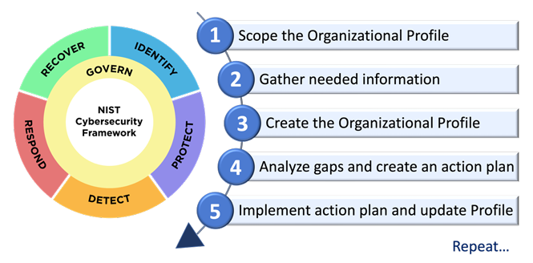

The NIST Cybersecurity Framework (CSF) 2.0, released in 2024, introduces the concept of an *Organizational Profile* as a structured way to measure an organization’s cybersecurity maturity and plan improvements.  
Figure 3 in the framework visually outlines the five key steps for building and using a CSF Profile—essentially, a process for conducting a comprehensive gap analysis.

---

## Step 1 — Scope

In this phase, organizations determine which systems, assets, and environments will be evaluated.  
Scoping defines the boundaries of analysis—whether that’s a single department, an enterprise network, or a specific critical function such as cloud infrastructure or industrial control systems.

*Key questions:*
- Which business units or systems are included?
- What regulatory or mission drivers define the boundaries?
- Are third-party systems in or out of scope?

---

## Step 2 — Orient

Orientation identifies organizational priorities, threat context, and risk tolerances.  
Here, stakeholders map their existing cybersecurity activities to CSF *Functions* and *Categories*, and align them with business objectives or external standards such as ISO 27001 or SOC 2.

> Example: A healthcare organization might orient its profile around HIPAA compliance and patient-data protection, while a university might prioritize research data integrity.

---

## Step 3 — Create Current Profile

A *Current Profile* captures the organization’s *as-is* cybersecurity state.  
It maps existing controls and practices against the CSF Core outcomes.  
Each outcome (e.g., *PR.AC-1: Identities are managed*) is evaluated for completeness or maturity—often rated as *Implemented*, *Partially Implemented*, or *Not Implemented*.

| CSF Function | Category | Example Outcome | Implementation Status |
|---------------|-----------|-----------------|-----------------------|
| Protect | PR.AC – Identity Management | PR.AC-1: Identities and credentials are issued, managed, verified, revoked, and audited. | Partially Implemented |
| Detect | DE.AE – Anomalies & Events | DE.AE-3: Event data are analyzed to understand attack targets and methods. | Implemented |

*Table 1. Excerpt from a sample Current Profile.*

---

## Step 4 — Conduct Risk Assessment

This stage identifies and prioritizes cyber risks that could impact mission outcomes.  
Organizations correlate threat intelligence, vulnerability data, and impact likelihood to assess exposure levels.  
The results inform which outcomes require the most attention when designing the *Target Profile*.

*Tools commonly used:* qualitative matrices, quantitative FAIR analysis, and heat maps to visualize likelihood vs. impact.

---

## Step 5 — Create Target Profile and Determine Gaps

A *Target Profile* represents the desired cybersecurity outcomes.  
By comparing it with the Current Profile, organizations identify *gaps*, the specific areas requiring improvement.

<figure>
  
  <figcaption><strong>Fig. 3. Steps for creating and using a CSF Organizational Profile</strong></figcaption>
</figure>

> *Gap analysis* reveals not only technical deficiencies but also policy, training, and process gaps that influence security posture.

---

## Continuous Improvement and Action Plan

After defining gaps, organizations develop an action plan to close them.  
Progress tracking should tie back to measurable risk reduction and be re-evaluated periodically.  
CSF 2.0 encourages integrating this process with enterprise risk management (ERM) functions for long-term resilience.

---

## Practical Example

In an academic cybersecurity lab environment, the same five-step approach can be applied to evaluate:
- Scope: lab servers and student authentication systems  
- Orient: institutional compliance with FERPA and internal IT policies  
- Current Profile: baseline security configurations  
- Risk Assessment: unauthorized access or data exposure scenarios  
- Target Profile: enhanced MFA and network segmentation

This structured evaluation helps ensure that improvements align with both mission goals and compliance standards.

---

## References

1. *National Institute of Standards and Technology (2024).* Cybersecurity Framework (CSF) 2.0. NIST Special Publication 1278.  
2. NIST CSF 2.0 Core Excel Mapping — https://www.nist.gov/cyberframework  
3. *NIST Interagency Report 8286.* *Integrating Cybersecurity and Enterprise Risk Management (ERM).*  
4. ISO/IEC 27001:2022 — *Information Security Management Systems.*

---

> *Originally researched August 2025 as part of ongoing Information Assurance coursework. This post documents the first in a multi-part series analyzing the NIST Cybersecurity Framework 2.0.*