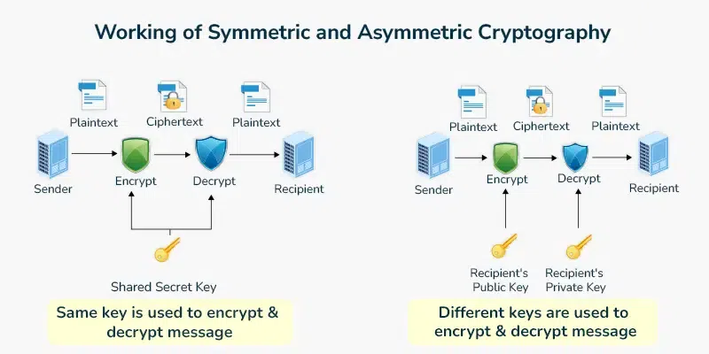

Modern secure communication protocols rarely rely on a single form of cryptography.  
Instead, they use *hybrid encryption*, combining the speed of symmetric algorithms with the robust key-exchange and authentication capabilities of asymmetric cryptography.  
While SSL/TLS is the most recognized example, it is far from the only one.

This article explores several other widely used protocols that implement hybrid encryption and examines how they balance *performance*, *security*, and *key management* in real-world systems.

---

## 1. The Principle of Hybrid Cryptography

In hybrid systems:

1. **Asymmetric encryption** (e.g., RSA, ECC, Diffie–Hellman) establishes or protects a session key.
2. **Symmetric encryption** (e.g., AES, ChaCha20) secures the actual data exchanged after that session key is agreed upon.

The asymmetric phase is computationally expensive but occurs only once per session.  
The symmetric phase is efficient and supports high-speed data transmission.

<figcaption>Figure 2. Comparison of symmetric and asymmetric encryption models:  symmetric uses a shared secret key, while asymmetric uses a public/private key pair.  <em>Image courtesy of GeeksforGeeks.</em></figcaption>

---

## 2. Secure Shell (SSH)

*SSH* secures remote terminal sessions and file transfers.  
It uses asymmetric cryptography for authentication and key exchange, followed by symmetric algorithms for encrypting session traffic.

**Key steps:**
1. The client and server perform a Diffie–Hellman key exchange (or ECDH, Ed25519).
2. The session key derived from that process becomes the symmetric key for AES or ChaCha20 encryption.
3. Message Authentication Codes (MACs) ensure integrity.

| Phase | Algorithm Type | Common Algorithms |
|--------|----------------|------------------|
| Key Exchange | Asymmetric | DH, ECDH, Ed25519 |
| Encryption | Symmetric | AES-CTR, ChaCha20-Poly1305 |
| Integrity | Hash/MAC | SHA-2, Poly1305 |

*Table 1. SSH hybrid encryption components.*

---

## 3. IPsec (Internet Protocol Security)

IPsec operates at the network layer to secure IP packets, using two primary modes:  
Authentication Header (AH) and Encapsulating Security Payload (ESP).

It employs asymmetric cryptography for Internet Key Exchange (IKE), which negotiates session keys and policies, and symmetric algorithms (AES, 3DES) for actual packet encryption.

Key design traits:
- Hybrid model ensures that key negotiation is confidential and authenticated.
- Symmetric encryption minimizes per-packet computational cost.
- IPsec is foundational in VPNs and secure site-to-site communications.

---

## 4. PGP and S/MIME (Secure Email)

Pretty Good Privacy (PGP) and S/MIME both implement hybrid encryption for email.  
They encrypt the message body with a symmetric key (often AES or CAST5), and then encrypt that symmetric key using the recipient’s public key (RSA or ECC).

**Workflow:**
1. Sender generates a random session key.
2. Message content → encrypted symmetrically.
3. Session key → encrypted asymmetrically with recipient’s public key.
4. Recipient decrypts session key, then decrypts the message.

This design enables secure one-to-many message delivery while avoiding the inefficiency of encrypting large content asymmetrically.

---

## 5. Signal Protocol (Double Ratchet)

The Signal Protocol, used in Signal, WhatsApp, and other messengers, is an advanced hybrid model that ensures forward secrecy and post-compromise security.

**How it works:**
- Uses asymmetric X25519 Diffie–Hellman ratchets to derive new keys for each message.
- Each message uses a new symmetric key, generated via a *symmetric-key ratchet*.
- Even if one message key is compromised, past and future messages remain secure.

This blend of asymmetric and symmetric cryptography is sometimes called a *“ratcheting hybrid system.”*

---

## 6. QUIC and TLS 1.3

While based on TLS concepts, QUIC (used in HTTP/3) and TLS 1.3 represent new generations of hybrid encryption.

Enhancements include:
- Ephemeral Diffie–Hellman keys for every session, ensuring perfect forward secrecy.
- Zero-Round-Trip Resumption (0-RTT) for faster secure connections.
- Simplified cipher suite negotiation to reduce downgrade risks.

Together, these protocols demonstrate how hybrid cryptography continues to evolve toward both security and performance optimization.

---

## 7. Comparative Summary

| Protocol | Asymmetric Function | Symmetric Function | Primary Use Case |
|-----------|--------------------|-------------------|-----------------|
| SSH | DH / ECDH | AES / ChaCha20 | Remote access |
| IPsec | IKE (RSA / DH) | AES / 3DES | VPNs / network layer security |
| PGP / S/MIME | RSA / ECC | AES / CAST5 | Secure email |
| Signal | X25519 Ratchets | AES / HKDF chain keys | Messaging |
| TLS / QUIC | Ephemeral ECDH | AES-GCM / ChaCha20 | Web and app transport |

*Table 2. Comparison of common hybrid encryption protocols.*

---

## 8. Why Hybrid Design Matters

Hybrid protocols address the conflicting needs of:
- **Confidentiality** (fast symmetric ciphers),
- **Authentication** (asymmetric identity proofs), and
- **Forward secrecy** (ephemeral key exchanges).

This architecture underpins nearly all secure communication today — from web browsers to mobile apps — and forms the basis for post-quantum transition planning, where symmetric key strengths can compensate for asymmetric algorithm uncertainty.

---

## References

1. *National Institute of Standards and Technology (2024).*  Cybersecurity Framework (CSF) 2.0.  
2. RFC 4253 — *The Secure Shell (SSH) Transport Layer Protocol.*  
3. RFC 6071 — *IPsec and Related Protocols Analysis.*  
4. RFC 4880 — *OpenPGP Message Format.*  
5. RFC 8446 — *The Transport Layer Security (TLS) Protocol Version 1.3.*  
6. Marlinspike, M., & Perrin, T. (2016). *The Double Ratchet Algorithm.*
7. GeeksforGeeks. *Working of Symmetric and Asymmetric Cryptography.*  Retrieved from https://www.geeksforgeeks.org

---

> *Originally researched October 2025 as part of an ongoing series on applied cryptography and information assurance.*
